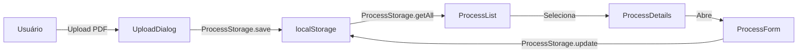

# 📋 Sistema de Gerenciamento de Processos

## Visão Geral

O sistema agora utiliza **localStorage** para armazenar e gerenciar os processos criados, substituindo os dados mockados. Todos os processos são salvos localmente no navegador do usuário.

## Funcionalidades

### ✅ Criar Novo Processo
1. Clique em **"Novo Processo"** na página inicial
2. Preencha as informações:
   - Título do Processo
   - Nome do Paciente
   - Tipo de Doença Ocupacional
   - Número do Processo
   - Upload do PDF
3. O processo é salvo automaticamente no localStorage

### 📁 Lista de Processos
- **Visualização**: Todos os processos criados aparecem na lista lateral
- **Busca**: Pesquise por título ou nome do paciente
- **Filtros**: Filtre por status (Pendente, Processando, Concluído)
- **Status em tempo real**: Badge colorido indica o estado atual

### 📊 Detalhes do Processo
- **Informações completas**: Paciente, doença, data, número do processo
- **Botão "Abrir Processo"**: Navega para a página de edição completa
- **Extração de informações**: Simula extração de dados do PDF
- **Geração de laudo**: Mockup de geração de laudo

### 🔄 Status dos Processos

| Status | Descrição | Badge |
|--------|-----------|-------|
| **pending** | Aguardando processamento | Cinza (Secondary) |
| **processing** | Sendo processado | Azul (Default) |
| **completed** | Concluído | Verde (Outline) |

## Arquitetura

### Módulo ProcessStorage (`lib/process-storage.ts`)

Responsável por todas as operações com localStorage:

```typescript
// Obter todos os processos
ProcessStorage.getAll()

// Obter um processo específico
ProcessStorage.getById(id)

// Salvar novo processo
ProcessStorage.save(process)

// Atualizar processo existente
ProcessStorage.update(id, updates)

// Deletar processo
ProcessStorage.delete(id)

// Limpar todos
ProcessStorage.clear()

// Obter estatísticas
ProcessStorage.getStats()
```

### Interface StoredProcess

```typescript
interface StoredProcess {
  id: string                    // ID único (timestamp)
  title: string                 // Título do processo
  patientName: string           // Nome do paciente
  diseaseType: string           // Tipo de doença
  processNumber: string         // Número do processo
  fileName?: string             // Nome do arquivo PDF
  fileSize?: number             // Tamanho do arquivo
  uploadDate: string            // Data de upload (ISO string)
  status: 'processing' | 'completed' | 'pending'
  reportGenerated?: boolean     // Se o laudo foi gerado
  extractedInfo?: {             // Informações extraídas do PDF
    symptoms?: string
    occupationalHistory?: string
    diagnosis?: string
  }
}
```

## Componentes Atualizados

### 1. ProcessList (`components/process-list.tsx`)
- ✅ Carrega processos do localStorage
- ✅ Suporta IDs string
- ✅ Busca e filtros funcionais
- ✅ Formatação de datas em PT-BR
- ✅ Labels de status traduzidos

### 2. ProcessDetails (`components/process-details.tsx`)
- ✅ Carrega detalhes do localStorage
- ✅ Botão "Abrir Processo" funcional
- ✅ Atualiza status ao extrair informações
- ✅ Formatação de data/hora completa

### 3. UploadDialog (`components/upload-dialog.tsx`)
- ✅ Salva novos processos no localStorage
- ✅ Gera ID único (timestamp)
- ✅ Redireciona para página do processo

### 4. HomePage (`app/page.tsx`)
- ✅ Atualizado para usar IDs string
- ✅ Trigger de refresh funcional

## Fluxo de Dados



## LocalStorage

### Chave de Armazenamento
```
laudo_processes
```

### Estrutura dos Dados
```json
[
  {
    "id": "1737466123456",
    "title": "Processo LER/DORT - João Silva",
    "patientName": "João Silva",
    "diseaseType": "LER/DORT",
    "processNumber": "0001234-56.2025.5.01.0001",
    "fileName": "peticao_inicial.pdf",
    "fileSize": 2457600,
    "uploadDate": "2026-01-21T14:30:00.000Z",
    "status": "processing",
    "reportGenerated": false
  }
]
```

## Recursos Futuros

### 🚀 Próximas Melhorias
- [ ] Backup/export para JSON
- [ ] Import de processos
- [ ] Sincronização com backend
- [ ] Paginação da lista
- [ ] Ordenação customizável
- [ ] Tags/categorias
- [ ] Busca avançada

### 🔐 Segurança
- [ ] Criptografia dos dados
- [ ] Validação de integridade
- [ ] Limite de armazenamento

## Dicas

### Limpar Dados de Teste
```javascript
// No console do navegador:
ProcessStorage.clear()
// ou
localStorage.removeItem('laudo_processes')
```

### Ver Todos os Processos
```javascript
// No console do navegador:
console.table(ProcessStorage.getAll())
```

### Obter Estatísticas
```javascript
// No console do navegador:
console.log(ProcessStorage.getStats())
```

## Limitações do localStorage

- **Capacidade**: ~5-10MB por domínio
- **Persistência**: Dados permanecem até serem limpos manualmente
- **Sincronização**: Não há sincronização entre dispositivos
- **Backup**: Usuário deve fazer backup manualmente

## Migração para Backend

Quando implementar um backend, o `ProcessStorage` pode ser facilmente adaptado para fazer chamadas API mantendo a mesma interface:

```typescript
// Exemplo futuro
static async getAll(): Promise<StoredProcess[]> {
  const response = await fetch('/api/processes')
  return response.json()
}
```

---

**Nota**: Os dados são armazenados localmente no navegador do usuário e não são compartilhados entre dispositivos ou navegadores diferentes.
